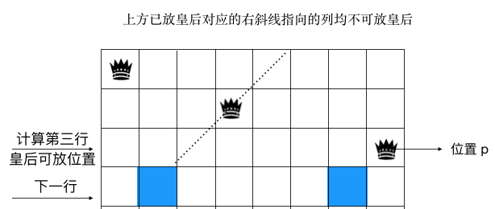

# 位运算

### 判断奇偶

x&1 == 1

x&1 ==0

### 除以二

x>>1

### 清零最低位的 1

x=x&(x-1) 

### 得到最低位的 1

x&-x 

所谓的 lowbit，就是取得最后一位 1 以及后续的0 组成的二进制数字

## n-queen 问题

* 关于 pie 和 na 的下一层参数



选定了 p 的位置之后，计算下一行的pie 占据的位置。

如上图所示，第二行的皇后pie 攻击的范围，「与」上第三行的皇后的位置，影响到的第四行的格子，需要在上述的「与」结果基础上左移 1 位，即：(pie|p)<<1

同理，na 在下一行攻击到的范围： (na|p)>>1

# BloomFilter&LRU-Cache

###  布隆过滤器

核心点：

哈希函数

数组

添加/方法


优点：空间效率和查询时间远远超过一般算法

缺点：有一定的误识别率和删除困难

###  LRU Cache

1）实现双向链表的操作
2）使用 hashmap与双向链表来实现 lru

# 排序

### 快速排序

* 关于选择 pivot

可以选第一个元素，可以选择最后一个元素，甚至可以随机选。每一次的partition，都确保了 pivot 元素在正确的位置。

```

    private int partitionV1(int[] array, int begin, int end) {
        //pivot: pick end or start is both ok, even random pick is ok
        //counter: count of items which are less than pivot
        int pivot = begin, index = begin + 1;
        for (int i = index; i <= end; i++) {
            if (array[i] < array[pivot]) {
                swap(array, i, index);
                index++;
            }
        }
        swap(array, pivot, index - 1);
        return index;
    }

    private int partitionV0(int[] array, int begin, int end) {
        //pivot: pick end or start is both ok, even random pick is ok
        //counter: count of items which are less than pivot
        int pivot = end, counter = begin;
        for (int i = begin; i < end; i++) {
            if (array[i] < array[pivot]) {
                swap(array, i, counter);
                counter++;
            }
        }
        swap(array, pivot, counter);
        return counter;
    }
```


